<div align="center">


# PERSEO

**A personal assistant with an always-on core and several faces:
voice, desktop panel, phone web app, and alerts in your pocket.**

It talks to you by voice in real time, triages your inbox before you open it,
writes to your memory, delegates coding tasks to other agents — and asks for
permission before doing anything it can't undo.

[](https://github.com/PersusUS/Perseo/actions/workflows/verificacion.yml)
[](LICENSE)
[](https://www.python.org/)
[](https://tauri.app/)
[](#verification)

[What it is](#what-it-is) · [What it looks like](#what-it-looks-like) ·
[How it works](#how-it-works) · [Install](#install) · [Privacy](#privacy) ·
[Español](README.md)

</div>

> **A note on language.** Perseo thinks and speaks in Spanish — that's the
> character, not an oversight. Its code, comments and interface are in Spanish
> too. This page is the map; the territory is Castilian.

---

## What it is

Perseo isn't a chat window. It's **a process that stays running on your
machine** — with its own work queue, memory and agents — and several
interfaces that connect to it.

The rule the whole design rests on: **the faces don't think.** The desktop
app, the phone web app and the voice session carry input and output; every
decision happens in the core. That's what makes it possible to move it to a
Raspberry Pi tomorrow without rewriting a line of interface code.

| | |
|---|---|
| 🎙️ **Real-time voice** | Continuous conversation over Gemini Live, with Perseo's face, a transcript, and hands: it opens programs, types, and watches your screen |
| 📬 **Mail triaged before you read it** | Every message lands in a bucket — ignore, interesting, needs action, not sure — decided by a **local** model, on your GPU |
| 🧠 **Real memory** | Markdown notes in your Obsidian vault. It searches, reads and **appends**; never overwrites, never deletes |
| 👤 **It knows who's talking** | Recognises voices and faces with local models, and learns people it hasn't met. Off by default |
| 🛑 **It asks first, and knows who asked** | Four confirmation levels enforced in the worker, not in the prompt. Anything irreversible stops and waits for your yes — and an order from a guest stops even while you are right there |
| 📱 **It follows you to your phone** | A PWA over your home VPN: chat, queue, mail and status. No build step, one single file |
| 🤖 **It delegates code** | Hands tasks to sub-agents (Claude Code or opencode) and tells you how they're going while they work |
| 🔌 **It speaks MCP** | Its own client for local and remote servers: vault, browser, Windows, triaged mail, sub-agents |

---

## What it looks like

### The call

The screen you see while you talk to it. Three layouts, the same information —
picked in Settings, switched live.

<div align="center">

<br><sub><b>Reticle</b> — rings, grid and readouts around the face</sub>
</div>

<div align="center">
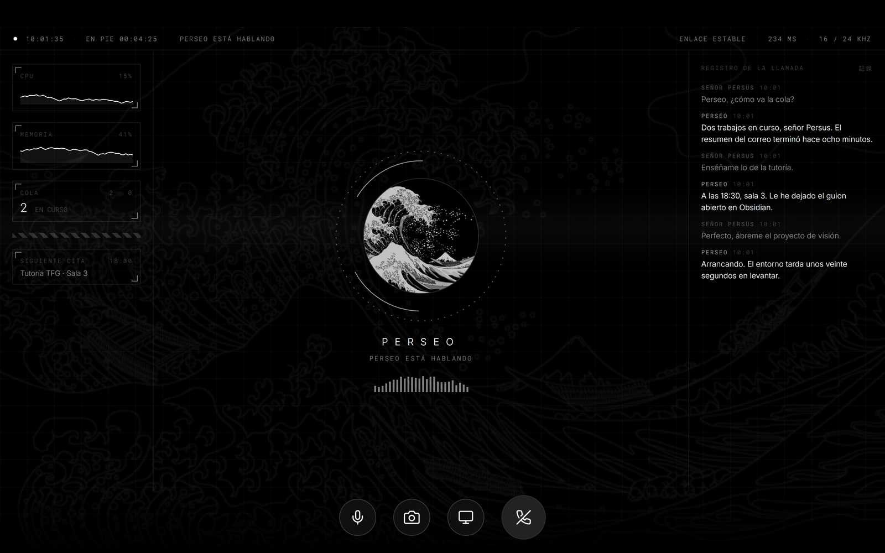
<br><sub><b>Command post</b> — instruments on one side, call log on the other</sub>
</div>

<div align="center">
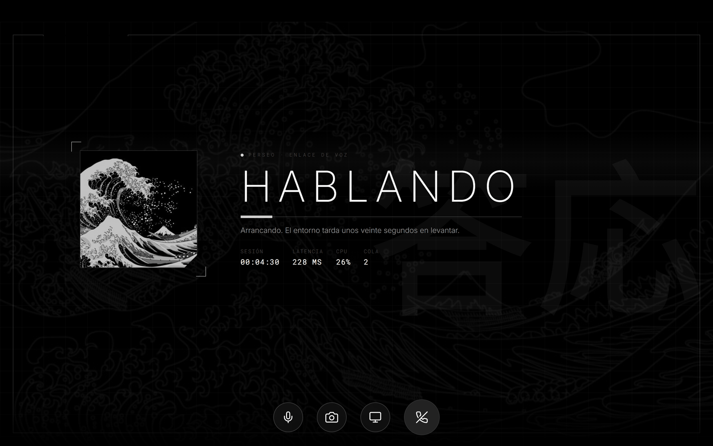
<br><sub><b>Billboard</b> — off-centre composition, status writ large</sub>
</div>

### The panel

Six tabs over the same things the core moves. Opens without cutting the call.

<table>
<tr>
<td width="50%">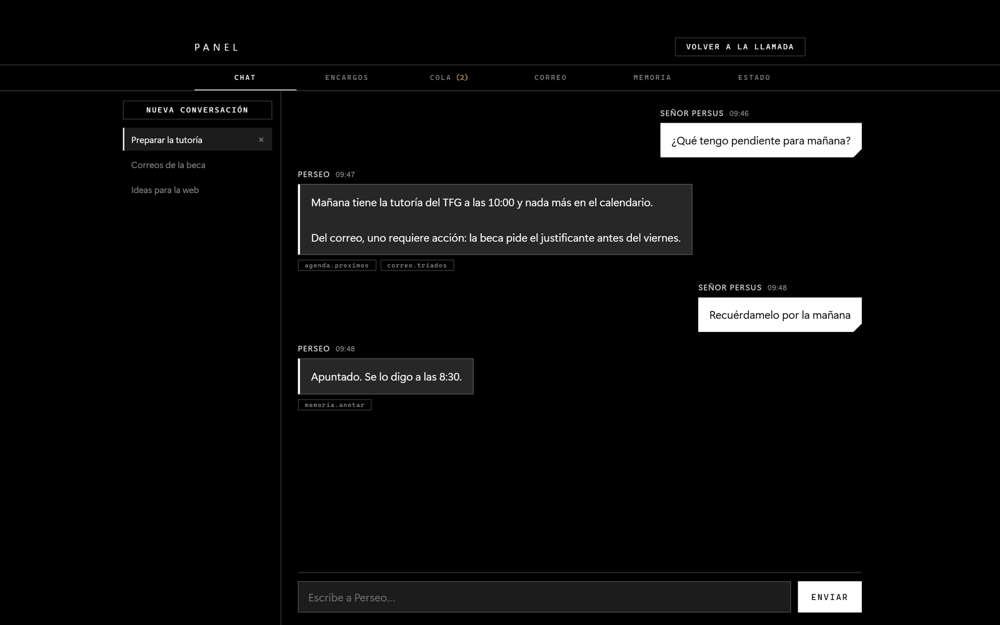<br><sub><b>Chat</b> — the written conversation, with the same hands the voice has</sub></td>
<td width="50%">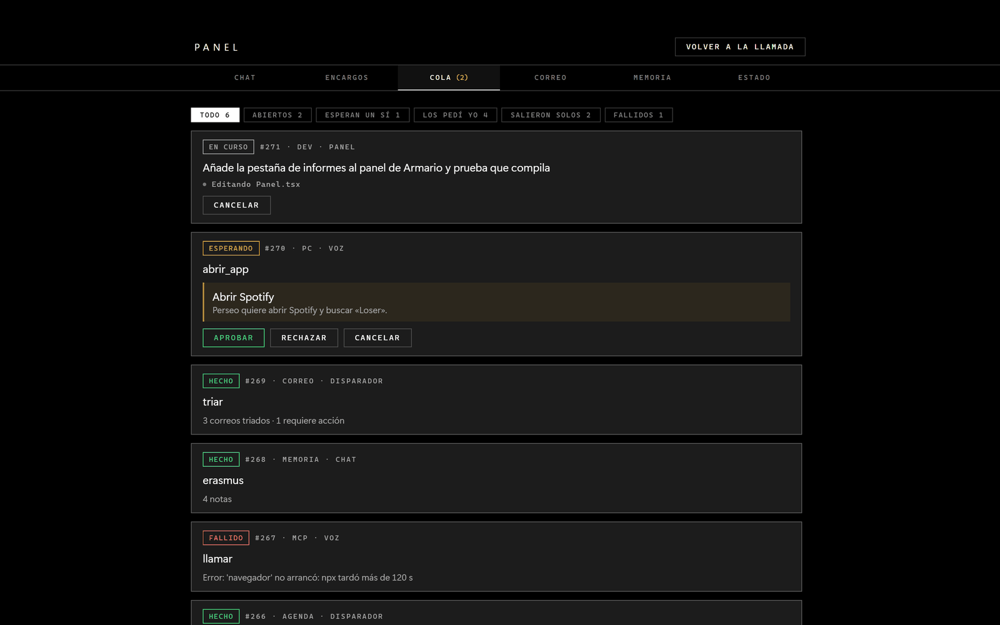<br><sub><b>Queue</b> — every job, its state, and who asked for it</sub></td>
</tr>
<tr>
<td>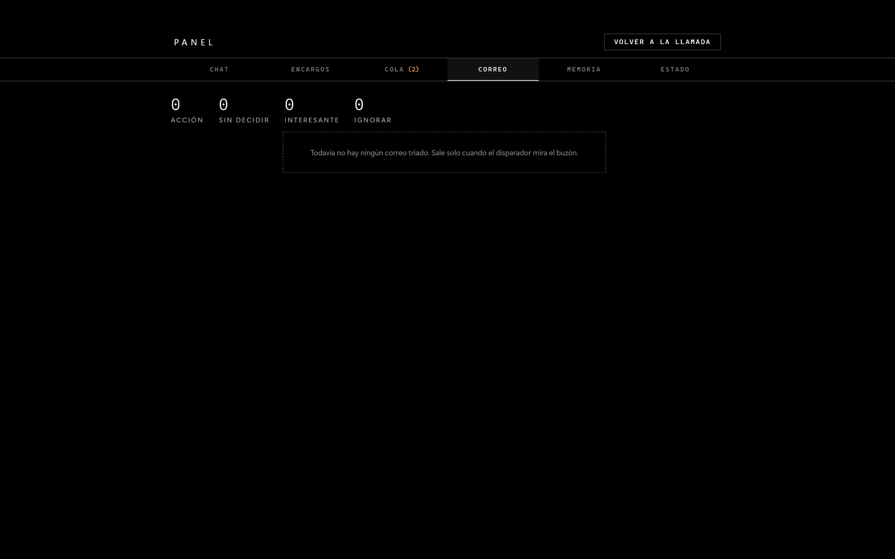<br><sub><b>Mail</b> — the inbox already triaged, and what you did with each one</sub></td>
<td>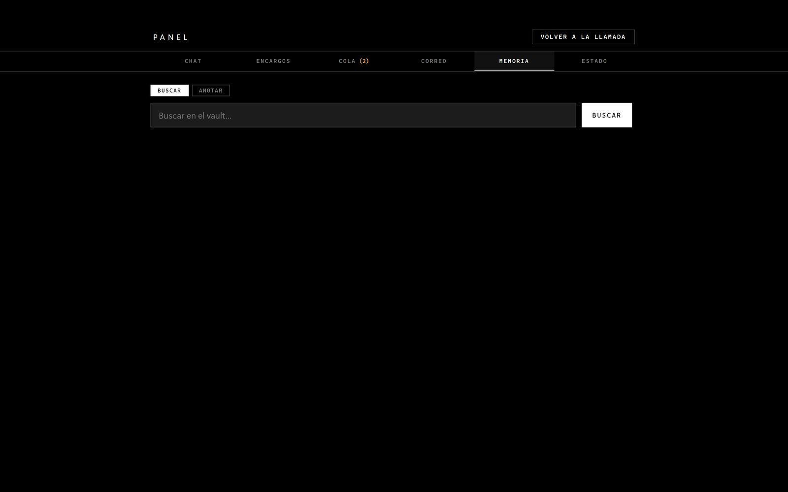<br><sub><b>Memory</b> — search and append to the vault without leaving</sub></td>
</tr>
<tr>
<td>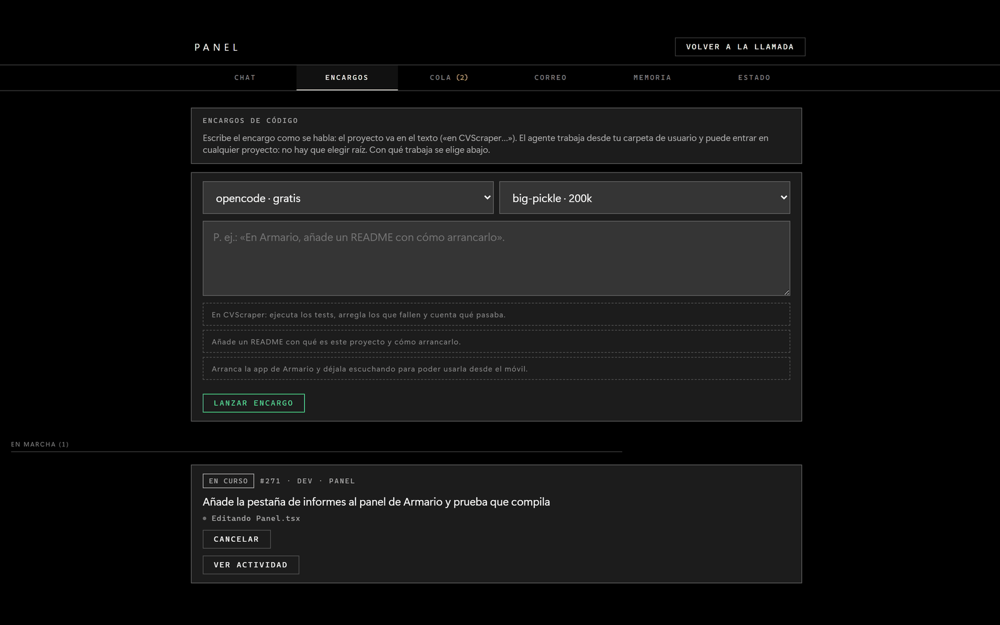<br><sub><b>Errands</b> — the coding sub-agents, and how far along they are</sub></td>
<td>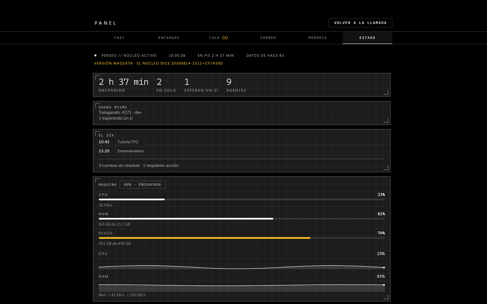<br><sub><b>Status</b> — what the system is missing today, and how the machine is doing</sub></td>
</tr>
</table>

### Board and habits

<table>
<tr>
<td width="50%">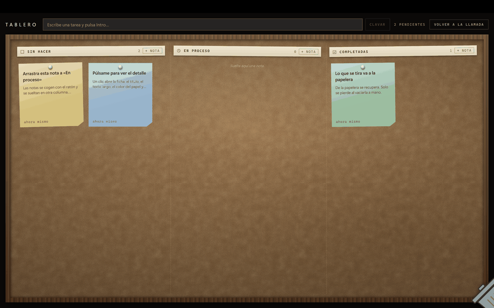<br><sub><b>Board</b> — notes you pin and drag. Perseo moves them too, by voice</sub></td>
<td width="50%">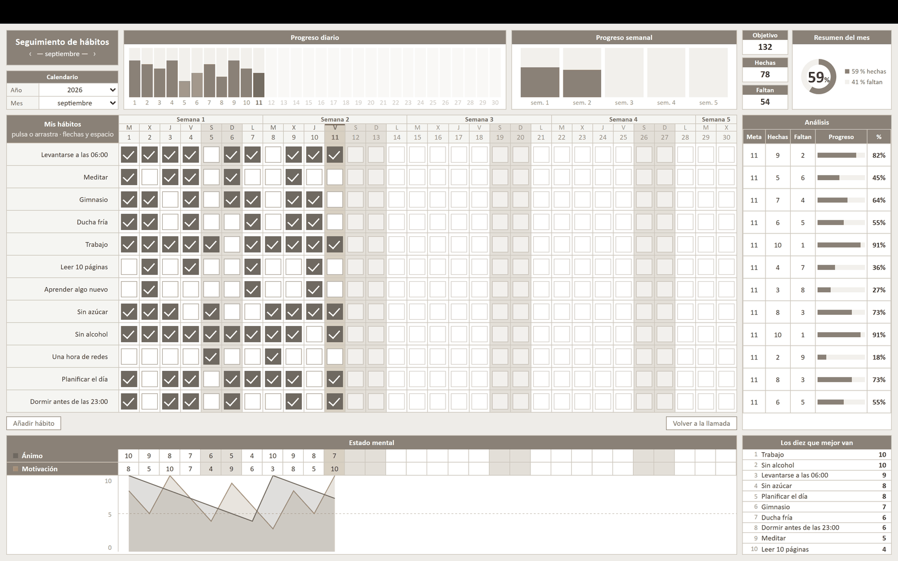<br><sub><b>Habits</b> — the whole month at a glance, in two skins</sub></td>
</tr>
</table>

### The phone

A PWA served by the core itself. Open it over your home VPN, paste the token
once, add it to the home screen.

<table>
<tr>
<td width="33%">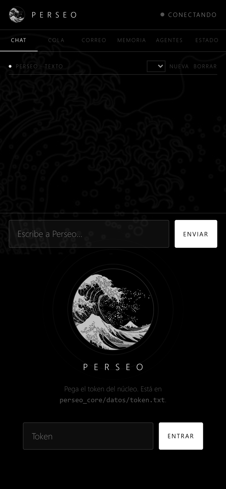<br><sub>The token, once</sub></td>
<td width="33%">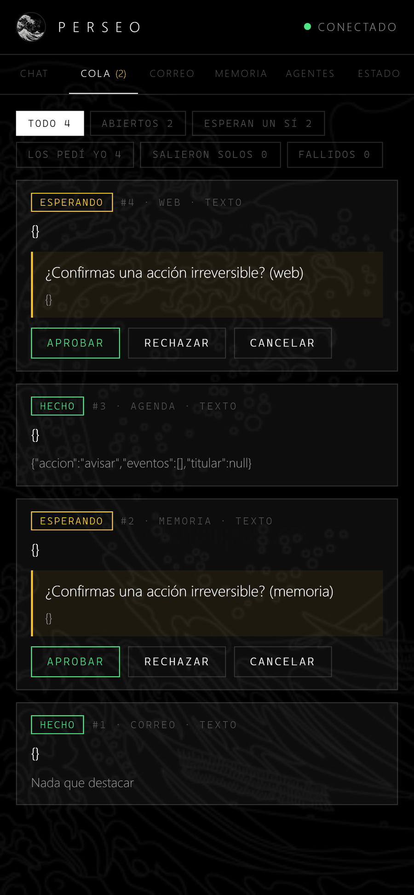<br><sub>The queue, with what's waiting on your yes</sub></td>
<td width="33%">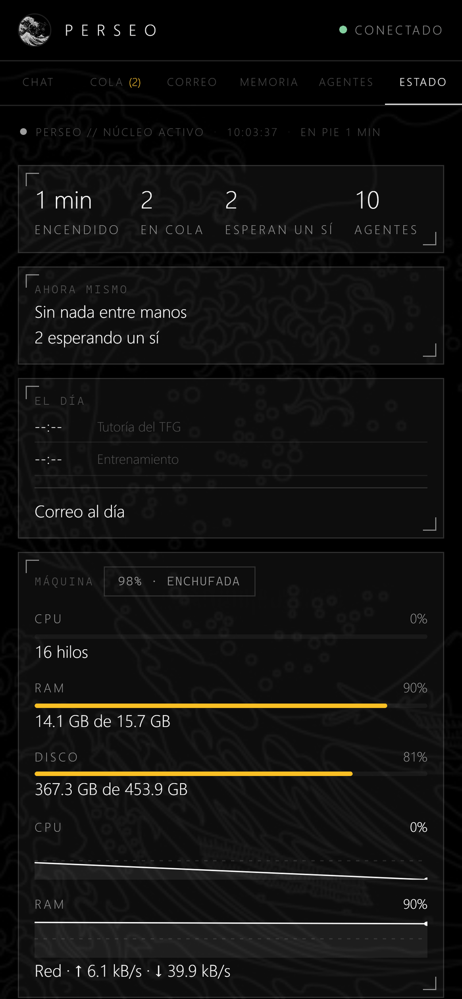<br><sub>What works today and what doesn't</sub></td>
</tr>
</table>

---

## How it works

```
   iPhone (PWA)              PC: Tauri app (tray)
        │ VPN                     │            │
        │                     text│      voice │
        ▼                         ▼            ▼
  ┌──────────────────────────────────────────────────┐
  │              perseo_core (Python)                │
  │                                                  │
  │  HTTP + SSE      event bus       queue (SQLite)  │
  │                                                  │
  │  ┌──────────── local router ─────────────────┐   │
  │  │  Qwen3 4B + grammar → picks a destination │   │
  │  └──┬────────────────────────────────────┬───┘   │
  │     │ answers now        queues (slow)   │       │
  │     ▼                                    ▼       │
  │                          ┌───────────────────┐   │
  │                          │ mail     calendar │   │
  │                          │ memory   dev      │   │
  │                          │ pc       web      │   │
  │                          │ chat     mcp      │   │
  │                          └───────────────────┘   │
  │                                                  │
  │  tiered confirmation policy                      │
  └──────┬───────────────────────────────────┬───────┘
         │                                   │
  ┌──────▼───────┐                  ┌────────▼────────┐
  │ Gemini Live  │                  │ Obsidian vault  │
  │ (voice)      │                  │ (memory)        │
  └──────────────┘                  └─────────────────┘
```

| Folder | What it is |
|---|---|
| [`perseo_core/`](perseo_core) | The core: queue, bus, API, local router, the agents and the policy |
| [`RealTime/`](RealTime) | The desktop app (Tauri 2 + React + TypeScript): voice, panel and screen |
| [`commands/`](commands) | The detector (two claps and a wake word), the `perseo` launcher and the project's own MCP servers |
| [`pruebas/`](pruebas) | The core's tests |
| [`docs/`](docs) | Configuration, API and privacy, in detail |

### The agents

An agent takes a job off the queue and resolves it. Every data source — the
inbox, the calendar, the vault, the browser — is a **port**: one
implementation behind it today, another tomorrow, without touching the agent.

| Agent | What it does | Behind it |
|---|---|---|
| `correo` (mail) | Triages incoming: ignore / interesting / needs action / not sure | Gmail, or a JSON file |
| `agenda` (calendar) | Warns about what starts soon, once per event | Google Calendar, or a JSON file |
| `memoria` (memory) | Searches, reads and **appends** to the vault. Never overwrites or deletes | Markdown files, or Obsidian's REST plugin |
| `chat` | Runs the written chat in the panel and on the phone, using the other agents' tools | Gemini REST with function calling |
| `dev` | Hands coding tasks to a sub-agent and **reports progress** while it works | `claude-agent-sdk`, or `claude -p`, or opencode |
| `pc` | Opens apps, types, moves the mouse. Allow-list, no shell | `pyautogui` (optional) |
| `web` | Reads pages and searches. Can't reach your home network | HTTP, no browser |
| `mcp` | Talks to the declared MCP servers: vault, browser, Windows, time, triaged mail | JSON-RPC over stdio with its own client; remote ones over HTTP with the official SDK |
| `eco`, `simulacro` | The two test agents: echo back what they get, touch nothing | — |

**Triage runs locally, and that's not an optimisation.** Gemini's free tier
gives 250 requests a day; every message the local model classifies on your GPU
is a request you didn't spend.

### Knowing who's in the room

On a call, Perseo can **put a name to each voice** — a chip says who's
speaking — and **label the faces** it sees through the camera. People it
doesn't know, it learns: about twelve seconds of a stranger's speech is enough
to pin a profile ("Unknown 1", renameable in Settings), and faces work the
same way by counting detections.

All of it is decided in the core with local models — ECAPA-TDNN for voice,
YuNet + SFace for faces — and all of it stays on your disk: the profiles are
just vectors of numbers, kept out of git. Nothing travels to any new service.

**It ships switched off**, because voice and face are biometric data: you turn
it on by hand, and deleting a profile really deletes its numbers.

### Tiered confirmation

The system reads mail and watches screens, which means untrusted content
reaching an agent with hands. So there's no "ask me yes or no" switch, but
three levels enforced **in the worker**, before the agent runs:

| Level | Examples | What happens |
|---|---|---|
| `free` | Read mail, read the vault, search, open an app | Runs |
| `reversible` | Append to the vault, edit code | Runs, and is logged |
| `irreversible` | Typing blind — and **anything not classified** | Stops and asks for a yes |

There is a fourth one, `critico` — deleting, touching the registry, killing
processes — that **always** asks, trust mode or not.

You give the yes from the web app, from the Telegram alert, or **out loud
during the call**. *Trust mode* lowers irreversible to reversible while you're
sitting there, and expires on its own: during a call it is renewed by your
voice, so it switches itself off if you walk away.

**Who asked counts too.** Every job travels with the profile of whoever spoke —
set by the voice recognition running on your own machine — and an order from
someone who isn't you stops even with trust mode on. Your yes also covers exact
repeats of the same request for ten minutes: dictating an address is six
identical orders, and asking six times teaches you to say yes without reading.

---

## Install

> **The minimum that works:** Python 3.11 and
> `pip install -r perseo_core/requirements.txt`. That gives you the core,
> the queue, file-based memory, the API and the phone web app. Everything else
> — voice, local triage, Gmail, Telegram, biometrics — is opt-in, and
> **the system starts fine without it**, telling you what's missing.

### Requirements

| | What for | Required? |
|---|---|---|
| **Python 3.11+** | The core. One single dependency: `aiohttp` | **Yes** |
| **Node.js 18+ and Rust** | Building the desktop app | Only for voice and the panel |
| **A Gemini key** | Voice and written chat | Only to talk to it |
| **[Ollama](https://ollama.com) with `qwen3:4b`** | The router and mail triage, locally | No: without it, it queues instead of deciding |
| **Obsidian** | Memory through the REST plugin | No: without it, memory goes to files |
| **Google credentials** | Real Gmail and Calendar | No: there's a fake inbox and calendar in JSON |

### 1 · The core

First things first: without it, the voice app has no memory and no hands.

```bash
git clone https://github.com/PersusUS/Perseo.git
cd Perseo
pip install -r perseo_core/requirements.txt
python -m perseo_core
```

It listens on `http://127.0.0.1:8787` and **generates a token by itself** the
first time, in `perseo_core/datos/token.txt`. That folder is outside git:
inside live the queue — with the literal text of what you ask it — and that
credential.

Check it:

```bash
curl http://127.0.0.1:8787/salud
```

### 2 · Tell it who it works for

Perseo ships with its author's name baked in. Two variables change it
everywhere the core thinks — the router, the triage and the chat:

```bash
export PERSEO_DUENO="Ada Lovelace"
export PERSEO_TRATO="Ms. Lovelace"
```

The long voice persona — the butler, the house, the pets — is edited
separately, in **Settings → System instructions**, inside the app itself.

### 3 · The desktop app

```bash
cd RealTime
npm install
npm run tauri dev
```

The **Gemini key is entered from the app itself** (the ⚙ button) and Rust
stores it in the system's local store.

> Don't put it in a `.env` as `VITE_GEMINI_API_KEY`: Vite inlines variables
> with that prefix into the compiled JavaScript, so the key would end up in
> clear text inside the `.exe`. If you'd rather use an environment variable,
> use `GEMINI_API_KEY` — no prefix — which is read at runtime.

### 4 · The phone (optional)

Open `http://<your-VPN-address>:8787` in your phone's browser, paste the token
once, and add it to the home screen. To make the core listen beyond the
loopback:

```bash
PERSEO_CORE_HOST=127.0.0.1,100.64.0.1 python -m perseo_core
```

With [Tailscale](https://tailscale.com), the word `tailscale` resolves your
tailnet address by itself: `PERSEO_CORE_HOST=tailscale`.

> Browsers only grant the microphone in a secure context. To talk to it from
> your phone, serve over HTTPS with `PERSEO_TLS_CERT` and `PERSEO_TLS_CLAVE`
> — `tailscale cert` issues them.

### 5 · Gmail and Calendar (optional)

You need OAuth credentials, created once in the Google Cloud console. The file
goes in `perseo_core/datos/`, outside git, because it carries a
`refresh_token`:

```json
{ "client_id": "…", "client_secret": "…", "refresh_token": "…" }
```

```bash
python -m perseo_core.autorizar_google     # opens consent and stores the token
python -m perseo_core.google_api           # checks the credentials work
PERSEO_CORREO=gmail PERSEO_AGENDA=google python -m perseo_core
```

Only **headers and the snippet** are read from mail: the body is never
downloaded, because triage doesn't need it — and **what you don't fetch can't
leak by accident**.

No Google account? Drop in two JSON files and try the whole thing:

```bash
PERSEO_CORREO=falso PERSEO_AGENDA=falso python -m perseo_core
```

### 6 · The clap detector (optional, Windows)

```bash
pip install -r commands/requirements.txt
python commands/clap_detector.py
```

Two claps, or the wake word, and Perseo joins the call by itself.

### All at once

Once installed, one command from any terminal:

```bash
perseo            # starts whatever is missing: core, detector, app
perseo estado     # what's alive right now, touching nothing
perseo parar      # shuts down the core and the app
```

**Every environment variable is in [`docs/CONFIGURACION.md`](docs/CONFIGURACION.md)**,
and the API routes in [`docs/API.md`](docs/API.md). Both are in Spanish, but
the tables read fine in any language.

---

## Verification

None of this is checked by eye, and it's checked two ways.

**Unit tests** — each piece on its own, no network, no subprocesses. They tell
you *what* broke: **880** in total.

```bash
python -m pytest                       # 737, core and commands
cd RealTime && npm test                # 143, the interface
cd RealTime/src-tauri && cargo check   # and that the Rust compiles
```

**Verifiers** — the whole system, against the real process. They tell you
*whether* it works. None touches real state: each one spins up a temporary
data directory and fake servers.

```bash
python perseo_core/verificar_fase_a.py          # the core: queue, restarts, SSE
python perseo_core/verificar_aprobaciones.py    # the confirmation path
python perseo_core/verificar_politica.py        # the levels and trust mode
python perseo_core/verificar_pc.py              # injection attempts against `pc`
python perseo_core/verificar_web.py             # `web`, without touching the internet
python perseo_core/verificar_biometria.py       # voices and faces: learn, rename, delete
# …seventeen in total, all in perseo_core/verificar_*.py
```

The first blocks run on every push
([Verification](.github/workflows/verificacion.yml)), on Linux and Windows.

---

## Privacy

Three things the design protects, and not just in words:

- **The vault never leaves your disk.** Memory is Markdown files on your
  machine. No vector database, no embedding service, no cloud copy.
- **Headline out, detail in.** Telegram — a third party — gets the count:
  "3 messages, 1 needs action". Never the subject, never the body. The detail
  is read in the web app, over your own VPN.
- **The API exposes no tools.** Over HTTP you enqueue a job for an agent; what
  that agent may do is the core's decision. It never listens on `0.0.0.0` and
  requires a token on every request.

And one rule that runs through the whole system: **anything arriving by mail,
screen or web is observed information, never an instruction.** It's written
into all three models' prompts and guarded by a test that fails if someone
removes it.

What does leave your machine, stated plainly: **the call's audio and video go
to Gemini Live**, and the written chat to the Gemini API. That's it. The
details are in [`docs/PRIVACIDAD.md`](docs/PRIVACIDAD.md).

---

## Status

Perseo works and gets used daily, but it's a personal project: built for
**one** person on **one** Windows machine, and it shows. Behind it are roughly
49,100 lines, 880 tests and 17 verifiers.

If you clone it and something won't start, open an
[issue](https://github.com/PersusUS/Perseo/issues) — and if you fix it, even
better: [`CONTRIBUTING.md`](CONTRIBUTING.md).

---

## Licence

[MIT](LICENSE) — do what you like with it, credit me, and don't ask me for
warranties.

Created by **Jesús Pérez Bazarot**.
